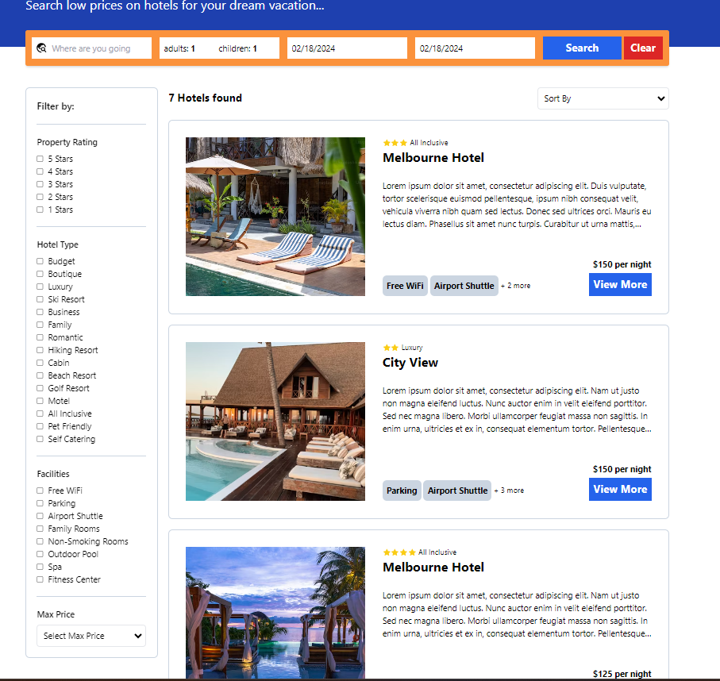

# Hotel Booking Full Stack App

A full stack web application build with MERN stack where user book hotel for their next holidays.

# Functionality of this app

- Hotel Booking application wheres users can add, update, search Hotels based different filters and selection criteria. Hotel booking is fully integrated with Stripe.

# Installation

- to run in locally for education purpose
- Download or clone repository of - [MERN Booking App](https://github.com/kartavya99/MERN-Booking-App)
- Node.js is required to run the application

### Backend Configuration

Create .env file in Backend folder root dirt and add following Environment Variables

```
MONGODB_URL - MongoDB connection string from your own DB
JWT_SECRET - any random long key
FRONTEND_URL - either 3000 or 5173 depends on react or vite
CLOUDINARY_CLOUD_NAME - should be from your cloudinary account
CLOUDINARY_API_KEY - as per above
CLOUDINARY_API_SECRET - as per above
STRIPE_API_KEY - from stripe dashboard - use private key
```

### FrontEnd Configuration

Create .env file in Frontend folder root dirt and add following Environment Variables

```
VITE_API_BASE_URL - backend localhost url
VITE_STRIPE_PUB_KEY - from stripe dashboard - use public key
```

1. Backend

- navigate to the backend directory & run npm install & npm run dev or npm start

2. Frontend

- navigate to the frontend directory & run npm install & npm run dev

# live application

[MERN Booking App](https://mern-booking-app-7czr.onrender.com/)

# Below are the sample images of deployed application

## Home Page


## Single Hotel Page


## Hotel Search Page



# Features and Technologies uses

- MongoDB
- Express.Js
- React.js
- Node.js
- mongoose
- TypeScript
- Stripe
- Tailwind Css
- Playwright for E2E test
- React Query
- React-hook-form
- React-router-dom
- multer
- bcryptjs
- cloudinary
- express-validator

## Under the MIT license

[](https://opensource.org/licenses/MIT)

```

```
